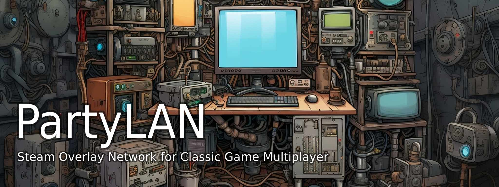

[Request a beta key](https://forms.gle/mVXYBTuUPrGjRP1b6)

PartyLAN is a tool for playing LAN games over the Steam Network. It is designed to be easy to use and work with any game that supports LAN play. The successor to [LPVPN](https://github.com/gyf304/lpvpn), which amassed 5.5K downloads before Discord discontinued its Game SDK.

[Compatible Games List](resources/github/lan-games-db/lan-games.csv)

https://github.com/gyf304/partylan/assets/7296537/ca1183e5-f3ba-4d95-8c65-6d3b18559d4e

## Usage

1. Download PartyLAN from [Steam](https://store.steampowered.com/app/1122990/PartyLAN).
2. Launch PartyLAN.
3. Ensure all players have PartyLAN installed and running. PartyLAN icon  should be visible in the system tray.
4. For the host, open the game and start as a LAN game host as normal.
5. For the clients, click the system tray icon , select the host in the "Online Friends" menu, an IP address should be copied to the clipboard.
6. For the clients, open the game and connect to the host using the IP address from the clipboard.

## License

PartyLAN is licensed under the [BSD License (3-Clause)](LICENSE).

### Third Party Licenses

Icon from Entypo pictograms by Daniel Bruce — [www.entypo.com](http://www.entypo.com)

Wintun driver licensed under [Prebuilt Binaries License](https://github.com/WireGuard/wintun/blob/master/prebuilt-binaries-license.txt)

Steamworks API licensed under [Steamworks SDK License](https://partner.steamgames.com/documentation/sdk_access_agreement)

